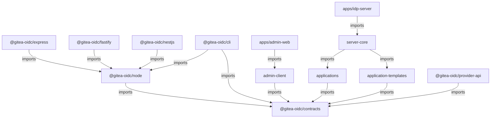

# Monorepo、应用管理与外部连接器架构草案

## 元数据

- 状态：accepted
- 创建日期：2026-07-10
- 来源：AI 辅助生成，维护者已确认继续实现
- 关联模块：`packages/server-core/`、`apps/idp-server/`、`apps/admin-web/`
- 关联任务：应用管理、应用模板、Node SDK、框架连接器和 CLI 重构
- 预计处理：按阶段实现，并将稳定设计迁移到 `docs/dev/`

## 背景

当前项目把 OIDC Provider、管理后台、配置加载、仓储、Provider API SDK、
Express/Nest 辅助代码和 Vue 组件发布在同一个 `gitea-oidc` 包中。
这造成以下问题：

- `packages/server-core/src/sdk/client.ts` 实际是 Provider API 代理，不是完整的 OIDC 登录客户端。
- Express 和 Nest 代码只把 Bearer Token 转发给 userinfo，没有覆盖 discovery、
  Authorization Code、PKCE、state、nonce、callback、session、refresh 和 logout。
- 没有 Fastify 连接器，也没有未支持框架可复用的 Node 协议核心。
- OIDC Client 只来自启动时 `clients[]` 配置，后台没有应用、模板、密钥轮换、
  停用和审计等控制面能力。
- 管理后台自身和业务应用共用 `clients[]`，职责与生命周期耦合。
- 根包同时携带服务端、数据库驱动、Vue 和框架依赖，SDK 消费者会安装不需要的依赖。
- 架构审查时，单包缺少发布文件白名单，实际 pack 会包含 `.htpasswd`、测试数据库、源码、
  测试、Agent 文件和陈旧构建产物；当前单包已先补白名单、清理构建和 tarball 契约测试，
  monorepo 中每个公开包仍必须独立继承这条门禁。
- 架构审查时 SDK 子路径的 `exports.types` 与实际声明文件目录不一致，已在单包止血阶段修复。

用户期望的新接入流程是：管理员先在管理系统创建应用，系统生成安全的接入配置和
产品专属说明；应用开发者再用 Node SDK、Express、Fastify、NestJS 或 CLI 接入。
应用创建需要同时支持 Gitea 等内置模板和通用自定义模式。

## 第一性原则

1. 应用是产品和协议的事实源，配置文件只能作为迁移或启动引导媒介。
2. 应用模板决定“生成什么配置和说明”，框架连接器决定“代码如何接入”；两者正交。
3. OIDC 协议只实现一次。框架包只能适配请求、响应、Cookie、生命周期和依赖注入。
4. 密钥是一次性交付的凭据，不是可以反复下载的普通应用配置。
5. 模板是版本化的声明和约束，不是在数据库中存储并执行的任意代码。
6. Monorepo 用于约束依赖方向、发布边界和兼容性，不以拆出尽可能多的包为目标。
7. 每个阶段都必须可构建、可测试、可发布或可回滚，禁止一次性大搬迁。

## 目标

- 建立应用、OIDC Client、模板、凭据和审计的明确领域边界。
- 支持从管理后台创建应用并获得可验证的接入配置。
- 提供框架无关的 Node OIDC 包，以及 Express、Fastify 和 NestJS 薄连接器。
- 提供安全、幂等、可诊断的接入 CLI。
- 为 Gitea 提供可执行的专属配置向导，同时保留通用自定义应用能力。
- 保留现有 `gitea-oidc` 服务端和旧 SDK 子路径一个兼容周期。
- 建立多包构建、测试、版本、pack 和发布门禁。

## 非目标

- 第一阶段不拆分每一种 Provider、Repository 或 OIDC Artifact Adapter。
- 第一阶段不开放公共 Dynamic Client Registration 端点。
- 第一阶段不允许第三方上传或执行自定义模板代码。
- 第一阶段不提供浏览器 SPA 中保存 `client_secret` 的 SDK。
- 第一阶段不承诺多个 Client Secret 的无损宽限轮换。
- 不在一次变更中同时完成目录迁移、数据迁移、SDK 重写和旧 API 删除。

## 产品模型

### 应用、Client 和凭据

`Application` 是管理后台展示和授权管理的聚合根。一个应用允许关联多个
`OidcClient`，以便未来同一产品同时接入服务端 Web、桌面端和 CLI；V1 管理界面可先限制
为一个应用创建一个 Client。

```typescript
interface Application {
  id: string;
  name: string;
  slug: string;
  description?: string;
  status: "draft" | "active" | "disabled" | "deleted";
  source:
    | { kind: "template"; templateId: string; templateVersion: number }
    | { kind: "custom"; schemaVersion: number }
    | { kind: "system" };
  templateInput?: unknown;
  templateSnapshot?: ResolvedApplicationTemplate;
  trustLevel: "first_party" | "third_party";
  consentPolicy: "explicit" | "skip_for_trusted";
  environment: "development" | "staging" | "production";
  owner?: string;
  version: number;
  createdAt: string;
  updatedAt: string;
}

interface OidcClient {
  id: string;
  applicationId: string;
  clientId: string;
  clientType: "confidential" | "public";
  tokenEndpointAuthMethod: "client_secret_basic" | "none";
  grantTypes: string[];
  responseTypes: string[];
  redirectUris: string[];
  postLogoutRedirectUris: string[];
  allowedScopes: string[];
  allowedResources: string[];
  pkcePolicy: "required" | "optional";
  capabilities: {
    providerApi: boolean;
  };
  status: "active" | "disabled";
}
```

关键约束如下：

- `clientId` 由系统生成且稳定，不随应用名称改变。
- 生产环境的 redirect URI 必须使用 HTTPS、精确匹配、无 fragment、无通配符。
  开发环境只对 loopback 地址放宽 HTTPS 要求。
- public Client 不生成 Secret，并强制 PKCE S256。
- 自研 Node 和框架连接器使用的 confidential Client 也默认使用 PKCE S256。
- 产品模板必须按照目标产品的已验证能力设置 PKCE，不能假设所有第三方系统都支持。
- 第三方应用默认显示 consent，不允许模板自行将应用标记为受信任。
- 管理后台使用独立的 `source=system` 应用，不与 Gitea 等业务 Client 共用。
- 停用应用时，需要按 `client_id` 撤销关联 grant、code、access token 和 refresh token。

### 密钥存储

OIDC Provider 在校验 `client_secret_basic` 和派生对称密钥时需要可恢复的 Secret，
因此数据库不能只保存单向哈希，也不能继续由通用 OIDC Adapter 明文序列化 Client。

`ApplicationSecret` 应使用独立密钥域的信封加密或 KMS：

```typescript
interface ApplicationSecret {
  id: string;
  oidcClientId: string;
  ciphertext: string;
  iv: string;
  authTag: string;
  keyId: string;
  fingerprint: string;
  status: "pending_delivery" | "active" | "revoked" | "expired";
  deliveredAt?: string;
  createdAt: string;
  expiresAt?: string;
}
```

- 创建或轮换响应只显示一次 Secret，后续 API 只返回 fingerprint。
- 直接展示时，Secret 在响应事务中进入 `active` 并记录 `deliveredAt`。
- CLI 交付时，Secret 先处于 `pending_delivery`，setup exchange 原子领取后才进入
  `active`；setup code 过期则撤销待领取 Secret。
- `OidcClientProjection` 只在 Provider 执行客户端认证时解密。
- 加密主密钥必须与 Provider Token 加密密钥分域，且不能存入数据库。
- 日志、审计、错误、指标和列表 API 禁止出现 Secret、授权码和 Token。
- V1 Secret 轮换采用立即切换。若未来需要新旧 Secret 并行，必须单独设计客户端认证模型。

### 模板与自定义应用

模板使用仓库内版本化的纯声明定义：

```typescript
interface ApplicationTemplateDefinition<Input> {
  id: string;
  version: number;
  name: string;
  supportedVersions?: string[];
  inputSchema: unknown;
  resolve(input: Input, context: TemplateContext): ResolvedApplicationTemplate;
  buildGuide(context: IntegrationGuideContext): IntegrationGuide;
}
```

`IntegrationGuide` 必须是标题、说明、字段和代码块等结构化节点，由管理端统一转义渲染，
不能返回可执行脚本或任意 HTML。

创建应用时同时保存 `templateId`、`templateVersion`、原始输入和解析后的不可变快照。
模板升级不能静默修改已有应用，必须展示差异并由管理员显式确认。

产品上保留两个清晰入口：

- 使用模板：选择 Gitea 等已适配产品，填写少量产品参数并获得专属说明。
- 自定义应用：编辑通用 OIDC 参数，使用安全默认值，并把高级协议字段折叠显示。

内部两条路径最终都生成同一种 `ResolvedApplicationTemplate`，后续运行时不按产品名称分支。

### Gitea 模板

Gitea 模板只收集创建配置所需的产品信息：

- Gitea 基础 URL。
- Gitea 认证源名称或 slug。
- 目标 Gitea 版本。
- 环境和负责人。
- 可选的 group claim 映射和登出返回地址。
- 是否申请由管理员进一步审核为受信任的内部应用。

模板负责派生和锁定：

- 精确 callback URI。
- Authorization Code grant。只有目标 Gitea 版本已验证需要并支持 refresh token 时才启用
  refresh token grant。
- `client_secret_basic`。
- 与目标 Gitea 版本能力矩阵一致的 PKCE 策略。
- 默认 `openid profile email` scopes。若启用 refresh token，必须同时申请
  `offline_access` 并执行相应 consent。
- discovery URL 和 post-logout redirect URI。

创建结果页应提供两个接入方式：

1. Gitea 管理后台中添加 OpenID Connect 认证源的逐字段说明。
2. 与当前 Gitea CLI 参数一致的 `gitea admin auth add-oauth` 命令模板。

命令模板必须使用 Secret 占位符。真实 Secret 只出现在一次性凭据区域，不能进入长期说明、
浏览器 URL、日志或审计记录。

Gitea 模板需要声明 `supportedVersions`，并对每个支持范围运行真实集成测试。在目标版本的
PKCE 能力通过验证前，模板不能强制 `pkcePolicy=required`；不在支持矩阵内的版本必须阻止
创建或明确标记为未验证，不能静默降级。

创建预览只做 URL 语法和策略校验，不因用户填写 Gitea URL 就从服务端发起任意网络请求。
若后续提供服务端连通性诊断，必须限制协议、DNS 解析结果、重定向和目标网段，防止 SSRF；
优先让 CLI `doctor` 从应用所在网络执行诊断。

### 应用创建向导

1. 选择模板或自定义模式。
2. 填写名称、环境、负责人和产品专属参数。
3. 预览最终 callback、grant、scope、认证方式和安全警告。
4. 单独确认信任级别、consent 策略和 Provider API capability。
5. 选择直接展示或 CLI 领取的凭据交付方式。
6. 事务性创建 Application、OidcClient、Secret、交付状态和审计事件。
7. 一次性展示凭据，或生成短期 setup code 供 CLI 交换。
8. 按 Gitea、Node、Express、Fastify、NestJS 和 CLI 标签展示接入说明。
9. 通过首次成功授权或诊断结果展示“已接入”状态。

创建请求应支持 `Idempotency-Key`。更新应使用版本号或 `If-Match`，避免两个管理员互相覆盖。

## 可重复配置与一次性凭据

系统需要明确区分可重复查看的连接描述和一次性凭据：

```typescript
interface ApplicationConnectionV1 {
  schemaVersion: 1;
  applicationId: string;
  oidcClientId: string;
  issuer: string;
  clientId: string;
  clientType: "confidential" | "public";
  clientAuthMethod: "client_secret_basic" | "none";
  redirectUris: string[];
  postLogoutRedirectUris: string[];
  scopes: string[];
  resources: string[];
  flow: "authorization_code";
  pkce: {
    policy: "required" | "optional";
    methods: ["S256"];
  };
  template?: { id: string; version: number };
  capabilities: {
    refreshToken: boolean;
    providerApi: boolean;
    resourceServer: boolean;
  };
  recommendedConnector?: {
    packageName: string;
    minimumVersion: string;
  };
}

type ApplicationCredentialV1 =
  | {
      kind: "client_secret";
      clientSecret: string;
      expiresAt?: string;
    }
  | { kind: "none" };
```

`ApplicationConnectionV1` 可重复获取，但永远不包含 `clientSecret`。
`ApplicationCredentialV1` 只在创建或轮换时返回一次。

CLI setup code 使用高熵随机值、服务端只保存哈希并设置短 TTL。setup code 只授权领取单个
OIDC Client 的待交付凭据，不能获得管理 API 权限。

一次消费还必须允许安全网络重试：CLI 先生成临时密钥对，并把公钥和幂等 request ID 与
setup code 一起提交。服务端原子绑定首次请求，把凭据加密给该公钥，并在短 TTL 内为同一
request ID 返回同一密文；不同公钥、不同 request ID 或并发领取全部拒绝。CLI 确认解密后
acknowledge，服务端删除交付密文；未确认的记录自动过期。需要覆盖“服务端已领取但响应丢失”
场景，不能让网络故障永久丢失唯一凭据。

## Monorepo 结构

建议先建立以下边界，不在第一阶段继续拆细 Provider 和存储实现：

```text
apps/
  idp-server/              # 进程入口、listen、signal 和 Docker
  admin-web/               # 私有 Vue 管理端
packages/
  server-core/             # createIdentityServer，不 listen、不 process.exit
  applications/            # ApplicationService、Repository、Secret 和 Client 投影
  application-templates/   # custom、gitea 模板和结构化说明
  contracts/               # 版本化公开 wire contract
  oidc-client/             # 公开包 @gitea-oidc/node
  express/                 # 公开 Express 连接器
  fastify/                 # 公开 Fastify 连接器
  nestjs/                  # 公开 NestJS 连接器
  provider-api/            # 公开包 @gitea-oidc/provider-api
  admin-client/            # 私有管理 API typed client
  cli/                     # 接入 CLI
  connector-testkit/       # 私有或开发期连接器一致性测试
  legacy/                  # 可发布的旧 gitea-oidc 包兼容层
examples/
  node/
  express/
  fastify/
  nestjs-express/
  nestjs-fastify/
  gitea/
tooling/
  typescript/
  build/
  test/
```

公开包名暂按 `@gitea-oidc/*` 设计，在发布前必须确认 npm scope 和长期产品品牌。
框架无关包使用 `@gitea-oidc/node`，不使用 `native` 作为 npm 包名，避免与 React Native 混淆。

### 依赖方向



强制规则：

- 连接器不得依赖 `server-core`、数据库或 `oidc-provider`。
- `server-core` 不得导入任何框架连接器。
- 模板不包含框架协议逻辑，连接器也不识别 Gitea 等产品模板。
- `admin-web` 只消费管理 API contract，不直接导入服务端实现。
- 每个框架只作为对应连接器的 `peerDependencies`。
- examples 全部设置 `private: true`，并在 CI 中安装实际 pack 产物。

## Node OIDC 核心

`@gitea-oidc/node` 是产品所称的 Native SDK。它不依赖 Express、Fastify 或 NestJS，
提供两种明确能力：

- Relying Party：登录、callback、session、refresh 和 logout。
- Resource Server：校验 Bearer Token 并得到不含 Token 的 Principal。

```typescript
interface OidcRelyingParty {
  beginLogin(input: BeginLoginInput): Promise<{
    authorizationUrl: string;
    transactionId: string;
  }>;
  completeCallback(input: CompleteCallbackInput): Promise<{
    sessionId: string;
    principal: Principal;
    redirectTo: string;
  }>;
  getSession(sessionId: string): Promise<AuthSessionView | null>;
  refreshSession(sessionId: string): Promise<AuthSessionView>;
  logout(input: LogoutInput): Promise<{ redirectUrl?: string }>;
}

interface OidcResourceServer {
  authenticateBearer(token: string): Promise<Principal | null>;
}

interface ResourceServerPolicy {
  audiences: [string, ...string[]];
  requiredScopes?: string[];
  allowedClientIds?: string[];
}
```

该包应封装成熟的 OIDC RP 实现，不自行拼接协议。它唯一负责：

- discovery、Authorization Code 和 PKCE S256。
- state、nonce、随机数和精确 callback 校验。
- token exchange、ID Token 校验、refresh singleflight、userinfo 和 revocation。
- callback 一次性消费与 replay 防护。
- issuer、audience、client、nonce、state 和 post-logout redirect 校验。
- 协议错误分类、请求超时和敏感信息脱敏。

应用只传入 `issuer`，端点通过 discovery 获取，不再分别填写可能互相矛盾的 endpoint。

Resource Server 创建时必须提供至少一个 expected audience/resource，不能把 userinfo 成功
当作 API 授权依据。JWT access token 需要校验签名、issuer、audience、scope、token type 和
允许的 client；opaque token 必须通过 introspection 校验 `active`、`aud`、`scope`、
`client_id` 和 token type。服务端还需要按 `allowedResources` 签发对应 audience，否则该
Resource Server 能力不得标记为可用，以避免其他应用的 Token 被跨应用重放。

### Transaction 和 session

```typescript
interface AuthorizationTransactionStore {
  save(record: AuthorizationTransaction, ttlSeconds: number): Promise<void>;
  take(id: string): Promise<AuthorizationTransaction | null>;
}

interface AuthSessionStore {
  create(record: AuthSessionRecord, ttlSeconds: number): Promise<string>;
  get(id: string): Promise<VersionedAuthSessionRecord | null>;
  compareAndSwap(
    id: string,
    expectedVersion: number,
    record: AuthSessionRecord,
  ): Promise<boolean>;
  rotate(
    oldId: string,
    record: AuthSessionRecord,
    ttlSeconds: number,
  ): Promise<string>;
  delete(id: string): Promise<void>;
}

interface AuthSessionLock {
  withRefreshLock<T>(
    sessionId: string,
    ttlSeconds: number,
    task: () => Promise<T>,
  ): Promise<T>;
}
```

- `take()` 必须原子且一次性，不能实现为 `get()` 后 `delete()`。
- OAuth state 与浏览器持有的 transaction ID 使用两个独立随机值。
- 浏览器只保存 transaction/session ID，Token Set 和 refresh token 保留在服务端 store。
- callback 成功后使用原子 `rotate()` 旋转 session ID，防止 session fixation。
- refresh 在调用 Token Endpoint 前取得跨实例锁，完成后以 CAS 更新 session。
- 收到 `invalid_grant` 后必须在锁内重新读取版本，只销毁仍引用该 refresh token 的 session，
  不能删除另一个请求已经成功刷新的记录。
- 生产环境不提供静默 memory store 默认值。
- Cookie 默认 `HttpOnly`、`SameSite=Lax`，生产环境强制 `Secure`。
- `returnTo` 默认只接受本站相对路径，禁止任意外部 URL。
- 本地 logout 使用 POST 和 CSRF 防护，先删除本地 session，再执行 OP logout。

## 框架连接器

连接器只负责把 Node OIDC 核心映射到框架，不复制 discovery、PKCE、Token 或 session 逻辑。

### Express

- `createOidcRouter()`。
- `requireAuth()` 和 `optionalAuth()`。
- 类型安全的 `req.auth`。
- Cookie、redirect 和错误响应映射。

### Fastify

- 标准 Fastify plugin 和封装边界。
- `request.auth` decorator。
- `requireAuth` preHandler。
- 在 Fastify 生命周期内初始化和关闭 Node client。

### NestJS

- `OidcModule.forRoot()` 和 `OidcModule.forRootAsync()`。
- `OidcAuthGuard`、`OptionalOidcAuthGuard` 和 `@CurrentUser()`。
- `OidcService`。
- 基于 Nest `HttpAdapterHost` 等抽象，同时验证 Nest-Express 和 Nest-Fastify。

NestJS 包不得复用 Express options 或依赖 Express 连接器。未支持的 Node 框架直接调用
`@gitea-oidc/node`，自行处理 Cookie、redirect 和请求上下文。

## Provider API SDK

现有 `packages/server-core/src/sdk/client.ts` 应迁移为 `@gitea-oidc/provider-api` 的
`ProviderApiClient`，与 OIDC 登录 SDK 保持独立。

- 删除全局可变的 `setAccessToken()` 状态，改为每次调用传 Token，或注入异步
  `getAccessToken`。
- 公开请求/响应 DTO 与含明文 Token 的服务端仓储类型分离。
- Vue composable 若继续保留，只依赖 Provider API 包。
- Vue 登录按钮指向业务后端连接器的登录路由，不自行拼 OIDC authorization URL。
- 旧 `gitea-oidc/client` 暂时 re-export 旧语义并标记 deprecated，不能在 minor 版本中
  静默改成新的登录 SDK。

## 应用控制面和 OIDC Provider

公共 Dynamic Client Registration 保持关闭。管理后台通过受保护的
`ApplicationService` 写入 `ApplicationRepository`，Provider 的 `Client` Adapter
从该 Repository 投影 OIDC Client metadata：

```text
Client model -> ApplicationClientAdapter -> ApplicationRepository
其他 model -> SQLite 或 Redis OIDC Adapter
```

控制面数据使用 SQLite 或 PostgreSQL 持久化；Redis 可以缓存，但不能作为应用、模板引用、
Secret 和审计的唯一事实源。

`ApplicationRepository` 是业务 Client 的唯一事实源。现有静态 `clients[]` 只作为一次性
导入源，不能长期与数据库双写。管理后台自身的 system Client 由独立的受控 seed 创建。

迁移期使用显式的 `clientSource: "config" | "database"` 启动开关，Provider 每次启动只选择
一种 Client 来源，禁止 hybrid 查询或双写：

- `config` 模式保持现有行为，应用管理写入口不可用。
- `database` 模式只查询 ApplicationRepository，新建应用立即生效。
- 从 `config` 切换到 `database` 前，迁移命令事务性导入全部 Client 并检查 ID 冲突。
- 数据库已有同名 `client_id` 且 metadata 不一致时拒绝导入和启动，不能静默覆盖。
- 切换后 `clients[]` 只保留为可重复执行的迁移输入，不再传给 Provider。

当前全局自动授予缺失 scope 的逻辑需要改为读取应用的 `consentPolicy`。默认值必须是
`explicit`，只有经过审计的 first-party 应用才能跳过 consent。

Provider API 的 `allowedClientIds` 应迁移为 Application capability，避免维护第二份 Client
授权清单。

## 管理 API

建议的 V1 管理 API：

```text
GET    /admin/api/application-templates
GET    /admin/api/application-templates/:id/versions/:version
POST   /admin/api/application-templates/:id/preview
GET    /admin/api/applications
POST   /admin/api/applications
GET    /admin/api/applications/:id
PATCH  /admin/api/applications/:id
POST   /admin/api/applications/:id/enable
POST   /admin/api/applications/:id/disable
DELETE /admin/api/applications/:id
GET    /admin/api/applications/:id/clients
POST   /admin/api/applications/:id/clients
GET    /admin/api/applications/:id/clients/:clientId
PATCH  /admin/api/applications/:id/clients/:clientId
POST   /admin/api/applications/:id/clients/:clientId/secrets/rotate
POST   /admin/api/applications/:id/clients/:clientId/secrets/:secretId/revoke
GET    /admin/api/applications/:id/clients/:clientId/integration
POST   /admin/api/applications/:id/clients/:clientId/setup-codes
GET    /admin/api/applications/:id/audit-events
POST   /api/integrations/setup/exchange
POST   /api/integrations/setup/acknowledge
```

必须审计：应用创建、模板升级、URI/scope 修改、信任级别修改、Secret 创建/轮换/撤销、
应用启用/停用/删除。审计 before/after 数据必须脱敏。

首次创建时，setup code 只能领取 `pending_delivery` Secret。它原子激活并返回该 Secret、
`ApplicationConnectionV1` 和结构化接入说明。创建 setup code 不得重新暴露 active Secret；
对于已有 confidential Client，新的 setup code 必须先创建待交付的新 Secret，并在领取时
完成轮换。public Client 不需要 Secret。

## CLI

`@gitea-oidc/cli` 首阶段只处理应用开发者接入：

- `init`：交互式粘贴一次性 setup code，选择或探测 Node 框架，生成最小配置。
- `doctor`：检查 discovery、issuer、redirect URI、callback、Cookie/session 和连通性。
- `config validate`：校验连接描述和本地环境变量。
- `config print --redact`：只打印脱敏配置。

setup exchange 同时返回已创建应用的结构化接入说明，因此第一阶段 CLI 不需要管理 API 权限。
模板列表、应用管理和 Secret 管理命令只有在后续引入明确的管理员浏览器登录或设备授权后
才能增加，并通过共享的 `admin-client` 调用管理 API。

安全边界：

- setup code、Secret 和管理 Token 不接受命令行参数，避免 shell history 和进程列表泄漏。
- CLI 通过 HTTPS 调用 setup exchange API，不直接改认证服务数据库或配置文件。
- 写文件前展示 diff 并确认，不覆盖用户文件。
- Secret 文件权限设为 `0600`，并确保目标文件进入 `.gitignore`。
- `.env.example` 只写变量名和占位符。
- 所有输出默认脱敏，失败信息不回显 setup code。

服务端的 `clients[]` 导入属于运维迁移命令，应放在 idp-server 的本地管理命令中，
不与开发者 CLI 的远程权限混在一起。

## 构建、版本和发布

- 根 `package.json` 设置 `private: true`，只负责编排 workspace。
- `pnpm-workspace.yaml` 覆盖 `apps/*`、`packages/*` 和 `examples/*`。
- 使用 TypeScript project references 和 `pnpm -r`，初期不引入 Nx/Turbo。
- 每个公开包具有独立 `package.json`、README、`exports`、类型声明、测试和 `files` 白名单。
- `files` 只允许 `dist`、README、LICENSE 和必要元数据。
- 每次构建先清理输出目录，禁止陈旧 chunk 混入 tarball。
- 公共包不得继承会拒绝 npm/yarn 消费者的根 `preinstall`。
- 使用 `workspace:^` 表达内部公开包依赖。
- 使用 Changesets 管理多包 changelog、内部依赖升级和 release PR。
- SDK 家族在稳定前采用同步版本，server 和 Docker 独立发布。
- 不再在每次 main push 时无条件自动 patch 并同时发布 npm 和 Docker。

`apps/idp-server/package.json` 是 server 版本事实源，即使该 workspace package 保持 private。
Changesets 配置允许更新 private package 版本，server 使用 `server-vX.Y.Z` tag；只有 server
release 才构建同版本 Docker image。SDK 家族使用各公开包 tag。兼容期内的
`packages/legacy` 与 server 同步版本并继续发布 `gitea-oidc`。

Node SDK 暂定最低版本为 Node `>=20.19`，服务端保持 Node `>=22`。
SDK 以 ESM 为主，并在支持 `require(esm)` 的目标 Node 版本中做真实 CommonJS 消费测试；
是否额外生成 CJS 构建由消费测试结果决定，不预先维护两套未经验证的输出。

发布门禁至少包含：

- `pnpm -r lint`、typecheck、test 和 build。
- 每个公开包的 pack 内容白名单检查。
- 禁止 tarball 出现 `.htpasswd`、数据库、源码测试、`.agents` 和临时文件。
- 每个实际 tarball 的 ESM、CommonJS 和 TypeScript 消费测试。
- Express、Fastify、Nest-Express 和 Nest-Fastify 的 peer dependency 组合测试。
- 旧子路径兼容测试。
- CLI 临时目录 E2E、脱敏和不覆盖文件测试。

## 迁移方案

### P0：发布止血

- [x] 给当前包添加 `files` 白名单并清理发布前输出目录。
- [x] 排除 `.htpasswd`、测试数据库、源码测试、Agent 文件和临时产物。
- [x] 修复 SDK 子路径 `exports` 与声明文件路径。
- [x] 移除公共消费者不需要的强制 pnpm `preinstall`。
- [x] 增加基于实际 tarball 的发布契约测试。
- [x] 独立收口安全修复，避免与目录迁移混为一个实现变更。

### P1：只建立 Monorepo 边界

- [x] 将当前可发布包迁入 `packages/server-core`，包名仍为 `gitea-oidc`，并保留所有 exports。
- [x] 在兼容包可替代根包后，把根 workspace 改为 private 编排包。
- [x] 移动 `admin-src` 到 `apps/admin-web`，采用包内构建和显式静态资源装配。
- [x] 建立 `apps/idp-server` 生产进程入口。
- [x] 把 `createIdentityServer()` 与 `listen()`、signal、`process.exit` 分离。
- [x] 保留 `gitea-oidc` 兼容入口和当前运行行为。
- [x] 不修改存储、Provider 和认证业务逻辑。

P1 实施时把兼容 facade 与服务核心暂时放在同一个 `packages/server-core` package，而没有额外
创建依赖私有 core 的 `packages/legacy`。这是为了确保公开 JS 和声明文件不会泄露未发布的
workspace 依赖；待 npm scope 和新 SDK 包名确认、声明 bundling 门禁建立后再拆 facade。

### P2：完成第一个产品纵向闭环

- 建立 `contracts`、`applications` 和 `application-templates`。
- 实现 ApplicationRepository、Secret 加密、审计和 Client 专用 Adapter。
- seed 独立 system admin Client，并增加静态 Client ID 冲突保护。
- 实现最小管理 API、custom 应用创建页面、一次性凭据交付状态和
  `ApplicationConnectionV1`。
- 实现 `@gitea-oidc/node`。
- 用示例完成“创建 custom 应用 -> 一次获取凭据 -> Node 登录成功”。
- 使用显式 `clientSource=config|database` 做整源切换，禁止 hybrid 查询和双写。

### P3：框架连接器

- 实现 Express、Fastify 和 NestJS 薄连接器。
- 建立共享 connector conformance testkit。
- 增加 Express、Fastify、Nest-Express 和 Nest-Fastify 真实示例与 E2E。

### P4：Gitea 模板和 CLI

- 实现版本化 Gitea 模板、预览和结构化配置说明。
- 生成 Gitea 管理后台步骤和 CLI 命令模板。
- 实现 setup code、CLI `init`、`doctor` 和配置校验。
- 完成“创建 Gitea 应用 -> 按说明配置 -> 首次登录成功”的产品验收链。

### P5：迁移并淘汰静态 `clients[]`

- 提供幂等导入命令，保持现有业务 `client_id`、redirect URI 和协议元数据。
- 把现有 Secret 加密导入 ApplicationRepository。
- 拆出独立 system admin Client，并从业务 Client 删除后台 callback。
- 迁移 Provider API allowlist 为 Application capability。
- Provider 不再接收静态业务 `clients`，只从 Client Adapter 查询。
- 过渡版本把 `clients[]` 降为一次性导入源并输出弃用警告。
- 下一主版本删除旧配置和已弃用 SDK 子路径。

## 兼容策略

- `gitea-oidc` 继续作为服务端包或兼容 facade 至少一个主版本。
- `gitea-oidc/client` 保留旧 Provider API 语义并 deprecated。
- 旧 `/express`、`/nest` 和 `/vue` 在 minor 版本中不改变函数契约。
- 新的完整登录能力只从 `@gitea-oidc/node` 和框架包发布。
- 旧静态 Client 在迁移时保留原 `client_id`，不强迫现有 Gitea 立即换凭据。
- 每个兼容层都写明删除版本，不建立永久双实现。

## 测试策略

Node OIDC 核心需要真实 Provider 合约测试，至少覆盖：

- discovery 和 issuer mismatch。
- Authorization Code 与 PKCE S256。
- state/nonce 错误、callback 重放和 code 重用。
- callback/returnTo open redirect。
- session fixation。
- refresh rotation、并发 refresh 和 `invalid_grant`。
- opaque access token 的 userinfo 或 introspection。
- 本地 logout、OP logout 和 post-logout redirect。
- metadata/JWKS 缓存刷新。

所有框架连接器运行同一组 conformance 测试：登录、callback、Cookie、保护路由、可选认证、
错误映射和退出。Application 控制面测试还应覆盖事务、幂等、乐观锁、Secret 脱敏、停用撤销、
模板快照和审计完整性。

## 备选方案

### 只移动目录，不改变领域边界

不采用。它会把不完整的 SDK 和重复协议逻辑分散到更多包，增加依赖和发布成本。

### 直接开放 OIDC Dynamic Client Registration

不采用。当前产品需要受管理、带模板、审计和 Secret 交付的控制面；公共 DCR 不能替代这些能力，
还会扩大匿名注册和凭据管理攻击面。

### Client Secret 只存哈希

不采用。当前 Provider 的客户端认证需要可恢复的 Secret。若不实现独立加密存储，V1 只能支持
public Client，不能上线 confidential Client 管理。`private_key_jwt` 作为后续独立设计，
不进入 V1 contract。

### CLI 直接修改服务端配置或数据库

不采用。它会绕过 ApplicationService 的校验、审计、并发控制和密钥生命周期。

### 一开始引入 Nx 或 Turbo

暂不采用。pnpm workspace、TypeScript project references 和 Changesets 足以支撑当前规模；
只有构建耗时或任务图成为可测量瓶颈时再引入额外编排工具。

## 待确认决策

- [ ] 长期产品品牌和 npm scope 是否使用 `@gitea-oidc/*`。
- [ ] 框架无关包是否定名为 `@gitea-oidc/node`。
- [ ] 是否保留 `gitea-oidc` 服务端兼容包一个主版本。
- [ ] SDK 最低 Node 版本是否采用 `>=20.19`，服务端继续采用 `>=22`。
- [ ] 生产 ApplicationRepository 是否首发 SQLite 和 PostgreSQL，Redis 仅作缓存。
- [ ] confidential Client 的加密主密钥来源采用环境密钥环还是外部 KMS。
- [ ] V1 是否明确采用单 active Secret 和立即轮换。
- [ ] 新 SDK 家族是否在稳定前同步版本。

## TODO

- [x] 完成当前单包的 P0 发布止血并新增 tarball 内容断言。
- [ ] 为公开 package 和内部 package 建立依赖边界检查。
- [ ] 固化 `ApplicationConnectionV1` 和错误 contract。
- [ ] 为 Application、OidcClient、Secret、Template 和 Audit 编写数据库设计。
- [ ] 设计 Client Adapter 投影和现有 `clients[]` 幂等导入协议。
- [ ] 设计 application disable 后按 `client_id` 撤销所有授权产物的能力。
- [ ] 将全局自动 consent 改为 Application 策略。
- [ ] 完成 custom 应用与 Node SDK 的第一个纵向闭环。
- [ ] 实现框架连接器共享 conformance testkit。
- [ ] 实现 Gitea 模板、结构化说明和真实配置验收。
- [ ] 实现安全的 setup code 和 CLI。
- [ ] 建立 Changesets 多包发布流水线和兼容删除计划。

## 验收标准

- [ ] 根目录是 private workspace，公开包没有反向依赖 server。
- [ ] 每个公开 tarball 只包含白名单文件，且不含 Secret、数据库、源码测试和临时文件。
- [ ] 管理员能创建 custom 应用，并且 Secret 只在创建或轮换时展示一次。
- [ ] 管理员能使用 Gitea 模板获得可执行配置，并完成真实 Gitea 登录。
- [ ] Node、Express、Fastify、Nest-Express 和 Nest-Fastify 通过同一组登录合约测试。
- [ ] 未支持框架可以只用 `@gitea-oidc/node` 完成登录、session、refresh 和 logout。
- [ ] 停用应用后，新的授权请求被拒绝，已有授权产物按策略撤销。
- [ ] 模板升级不会静默改变已有应用。
- [ ] CLI 不在参数、stdout、日志或可提交文件中泄漏凭据。
- [ ] 现有静态 Client 可幂等导入，迁移前后的 `client_id` 和登录行为保持兼容。
- [ ] 旧包和子路径在约定的兼容周期内通过回归测试。
- [ ] `pnpm lint:md`、相关单元测试、E2E、pack 和消费者安装测试通过。

## 退出条件

满足以下任一条件后，本草案应被迁移或删除：

- 方案得到确认，各稳定边界迁移到 `docs/dev/`，任务进入实施。
- 方案被新的架构决策记录替代。
- 方案被明确废弃。
- 方案超过维护期限且没有继续价值。

## 参考资料

- [openid-client 官方仓库](https://github.com/panva/openid-client)
- [Changesets 官方仓库](https://github.com/changesets/changesets)
- [Gitea 认证文档](https://docs.gitea.com/administration/authentication)
- [Gitea 管理 CLI 文档](https://docs.gitea.com/administration/command-line)
